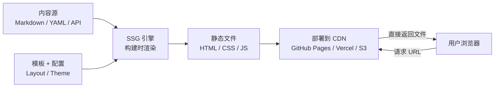

SSG 即 **静态站点生成器**，是一种在"构建时"把内容、模板和数据组合成完整 HTML/CSS/JS 静态文件的工具，生成的网站无需服务器端逻辑、无需数据库，访问时直接返回预先渲染好的页面。
与动态网站的区别在于：动态网站每次收到请求都要服务器实时查询数据库、渲染页面；SSG 则在部署前就把所有页面"烤好"，用户访问时服务器（或 CDN）直接返回文件，所有用户看到的内容一致。
## 工作原理
SSG 的核心流程可以拆成三步：
1. **读取内容源**——通常是 Markdown 文件、YAML/JSON 配置、图片资源，也可能从 CMS 或 API 拉取数据。
2. **套用模板**——用 Go Template、Liquid、EJS、React 等模板引擎，把内容填进页头、页脚、列表等布局模板里。
3. **生成静态文件**——输出一整个 `public/` 或 `dist/` 目录，里面全是可直接托管在任意 Web 服务器或 CDN 上的 HTML/CSS/JS。
整个过程可以用下面的流程图概括：

关键点在于"**构建时**"而非"请求时"——SSR（服务端渲染）是每次请求时在服务端渲染 HTML，SSG 则提前一次性渲染好，这也是它速度快的根本原因。
## 核心优势
- **加载快**：服务器只返回静态文件，TTFB（首字节时间）极短，可全部缓存到 CDN 边缘节点。
- **安全性高**：没有数据库、没有运行时代码执行，不存在 SQL 注入、XSS 等常见攻击面。
- **部署简单、成本低**：纯静态文件，GitHub Pages、Netlify、Vercel、对象存储都能托管，甚至免费。
- **SEO 友好**：页面是完整 HTML，搜索引擎可直接抓取，不像 CSR 那样依赖 JS 渲染。
- **版本控制友好**：内容都是文本文件，天然适合 Git 管理，便于团队协作。
## 局限
- **内容更新需重新构建**：每次改动都要跑一次 `build` 才能上线，页面越多构建越慢（Hugo 除外）。
- **缺乏动态交互**：用户登录、评论、实时数据这类功能需要额外接 Headless CMS 或后端 API。
- **对非开发者不友好**：没有可视化后台，发文章要走 Git 或命令行，对非技术人员有门槛。
## 代表工具
| 工具 | 技术栈 | 特点 |
|------|--------|------|
| **Hugo** | Go | 构建极快，单一二进制，适合大型站点 |
| **Hexo** | Node.js | 中文社区活跃，主题插件丰富 |
| **Jekyll** | Ruby | 最早的 SSG，GitHub Pages 默认支持 |
| **Gatsby** | React | 适合需要丰富交互、多数据源聚合的站点 |
| **Next.js / Nuxt.js** | React / Vue | 同时支持 SSG、SSR、ISR，属"全栈框架" |
| **Eleventy** | Node.js | 简洁灵活，被视为 Jekyll 的精神继承者 |
需要补充的一点是：**Next.js、Nuxt.js 这类现代框架其实同时支持 SSG 和 SSR 两种模式**，SSG 只是它们的一种渲染策略；而 Hugo、Hexo、Jekyll 这类传统 SSG 则是"纯静态生成"，只做构建时渲染，不做请求时渲染。
## 典型应用场景
SSG 最适合"**内容驱动、更新不频繁、对性能和 SEO 要求高**"的站点：个人博客、技术文档站（如 Vue 官方文档用 VuePress）、公司官网、产品介绍页、营销落地页、开源项目文档等。反过来说，如果你做的是电商、社交、后台管理这类需要实时数据、用户交互的应用，SSG 单独扛不住，通常要配合 SSR 或 BaaS 方案使用。
